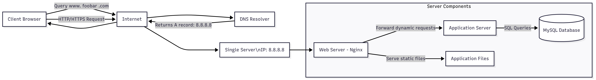
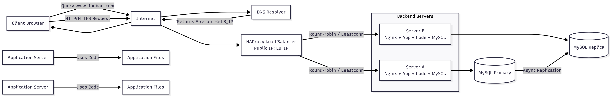
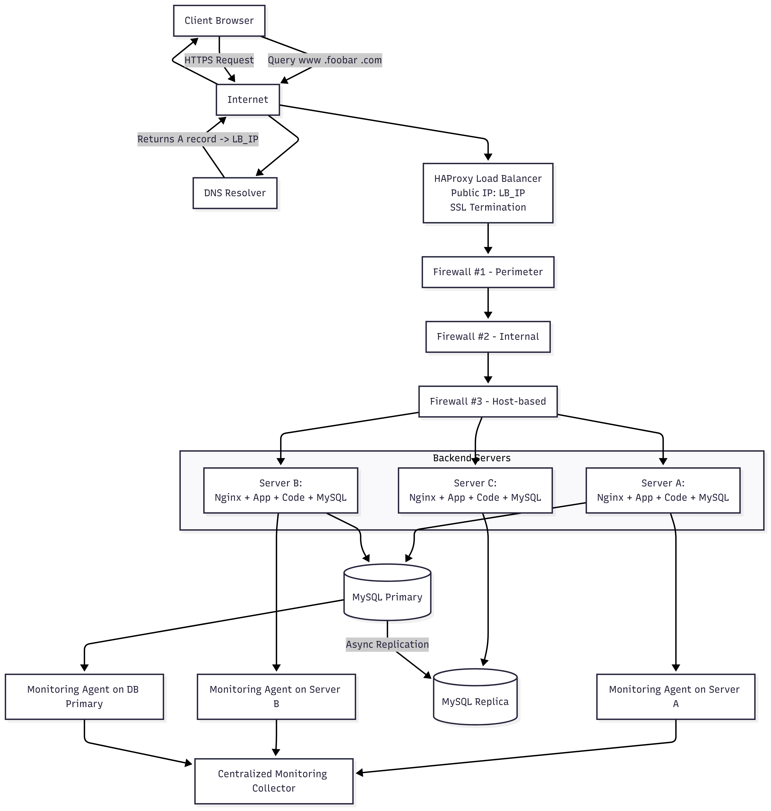
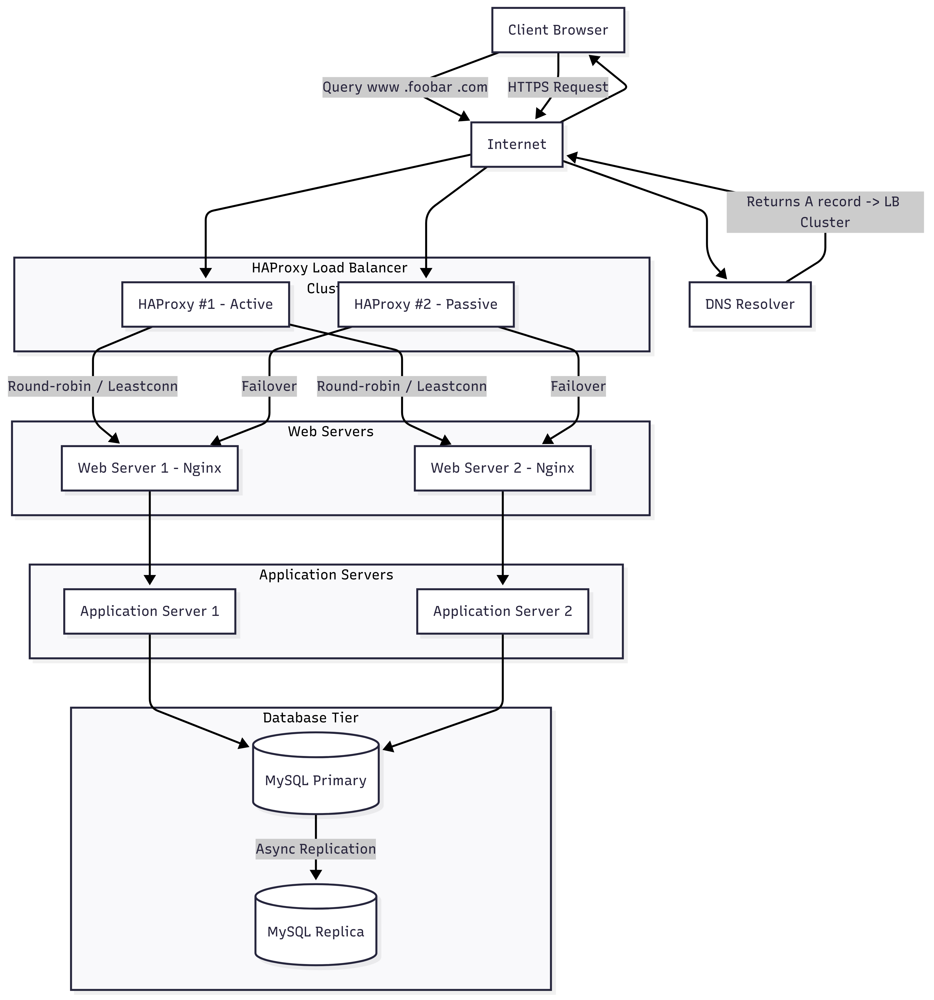

# Web Infrastructure Design

## Task 0 — Simple Web Stack

**Diagram:** 

**Q&A:**

- **What is a server?**  
  A physical or virtual machine providing services (Nginx, Application, MySQL).

- **Domain name role:**  
  Maps `foobar.com` / `www.foobar.com` to IP via DNS (A record).

- **DNS type for `www`:**  
  A record (maps to 8.8.8.8).

- **Web server role (Nginx):**  
  Handles HTTP/S requests, serves static files, forwards dynamic requests to application server.

- **Application server role:**  
  Executes application logic, generates dynamic responses, queries database.

- **Database role:**  
  Stores persistent data, responds to SQL queries.

- **Communication protocol:**  
  HTTP (80) / HTTPS (443) over TCP/IP.

- **Issues:**  
  SPOF (single server), downtime during maintenance, limited scalability, security risks if no firewall/HTTPS.

---

## Task 1 — Distributed Web Infrastructure

**Diagram:**

- **Why add these elements:**  
  Load balancer (HAProxy) distributes load; two backend servers provide redundancy and capacity; MySQL Primary-Replica improves read scaling.

- **LB distribution algorithms:**  
  Round-robin (even distribution), Least connections (send to server with fewest active connections).

- **Active-Active vs Active-Passive:**  
  Active-Active: both LBs handle traffic.  
  Active-Passive: one active, one standby (failover).

- **MySQL Primary-Replica:**  
  Primary handles writes, Replica handles reads; replication is async.  

- **Primary vs Replica:**  
  Primary: read/write; Replica: usually read-only, may be slightly outdated.

- **Issues:**  
  SPOF if single LB or Primary DB, no firewall/HTTPS = security risks.

---

## Task 2 — Secured and Monitored Infrastructure

**Diagram:**

- **Why add each element:**  
  Firewalls (perimeter, internal, host) for security; SSL certificate for encrypted traffic; monitoring agents for metrics/logs/QPS tracking.

- **Firewalls role:**  
  Control traffic, prevent unauthorized access.

- **HTTPS role:**  
  Encrypts traffic, ensures integrity/authentication, protects sensitive data.

- **Monitoring role:**  
  Collects metrics (CPU, memory, QPS), logs, and traces via agents to a central collector.  

- **Monitor web server QPS:**  
  Nginx stub_status or log analysis with Prometheus/Fluentd.

- **Issues:**  
  SSL terminated at LB → backend traffic unencrypted; single write MySQL = SPOF; same stack on all servers → resource contention, harder to scale.

---

## Task 3 — Scale Up

**Diagram:**

- **Why each element:**  
  HAProxy cluster (with keepalived) → high availability load balancing.  
  Separate tiers: Web tier serves static content and TLS; App tier handles dynamic processing; DB tier handles persistent data with replication.  
  Monitoring & firewalls ensure observability and security per layer.

- **Benefits:**  
  Independent scaling of each layer, reduced resource contention, improved fault tolerance.
